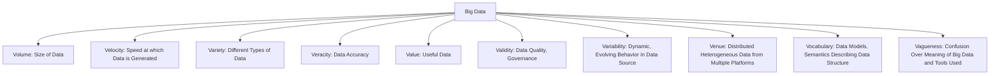
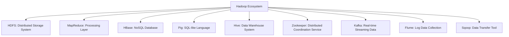
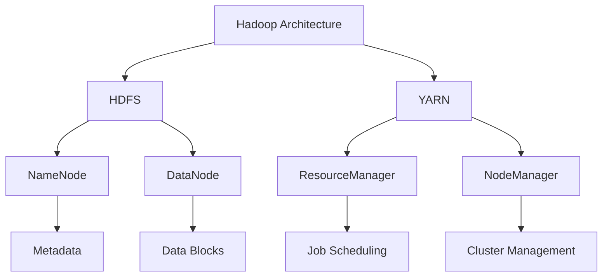
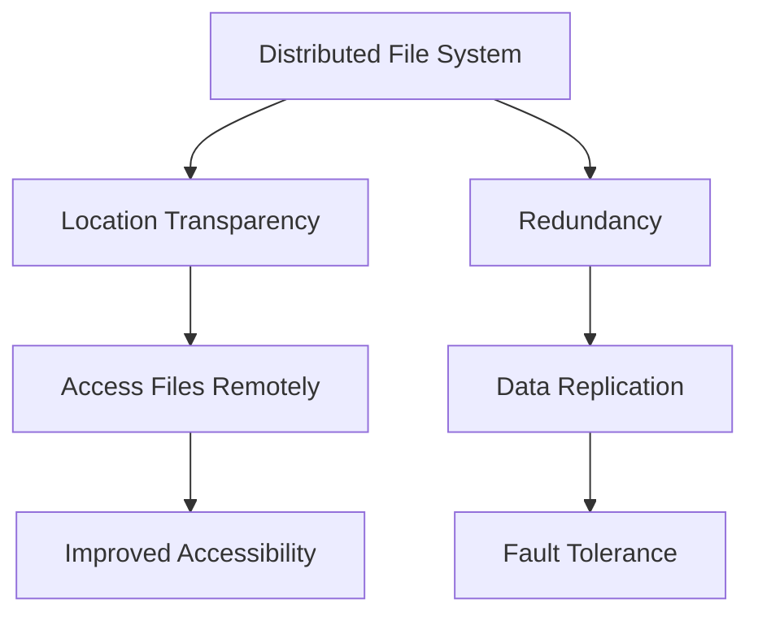

# unit 1

https://chatgpt.com/share/674ebbfe-49f0-800f-b3ff-d5b29ed40a93

https://chat.mistral.ai/chat/96526872-d815-494a-a24a-502d01265098

### Big Data Characteristics Diagram

### Hadoop Ecosystem Tools Diagram

### Hadoop Architecture Diagram

### Distributed File System (DFS) Diagram

These Mermaid diagrams should help visualize the key concepts and components discussed in the Big Data Analytics course. You can copy and paste these diagrams into any Markdown editor that supports Mermaid to view them.

<!--stackedit_data:
eyJoaXN0b3J5IjpbMTkzMDUyMTQwM119
-->